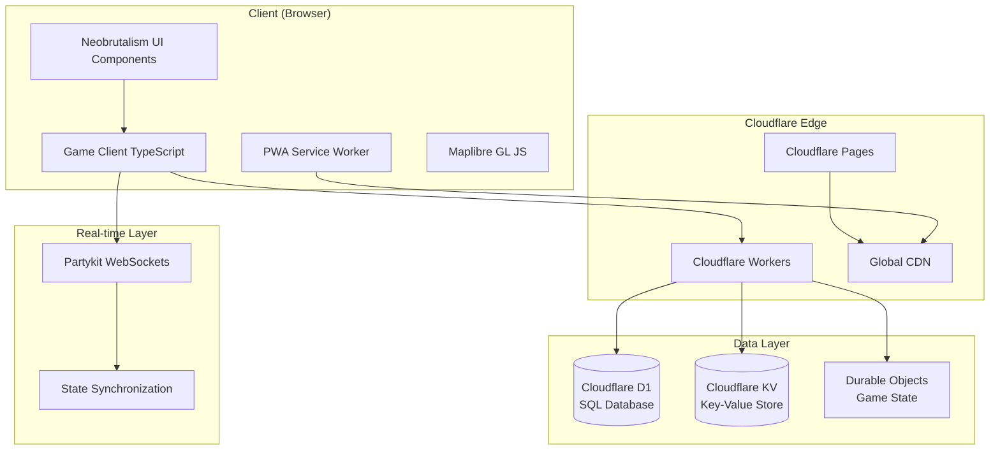
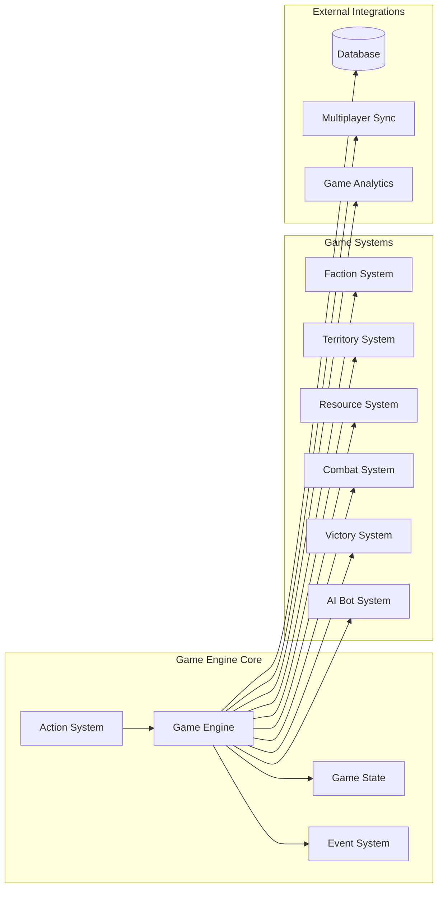
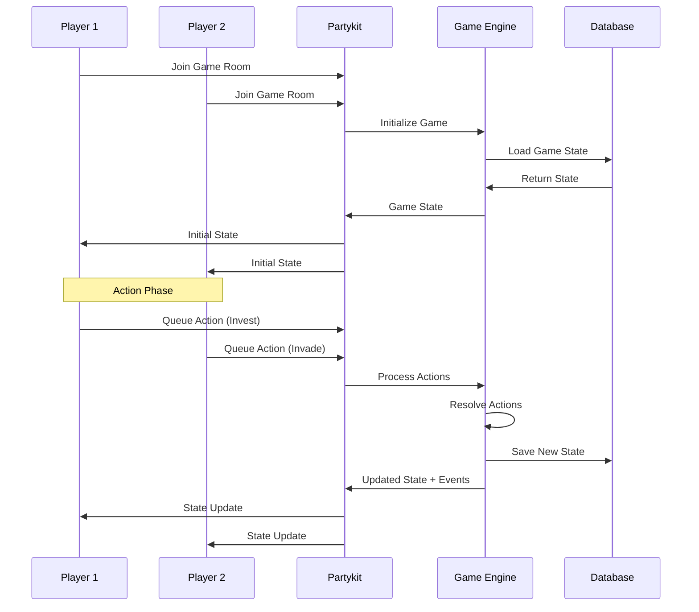
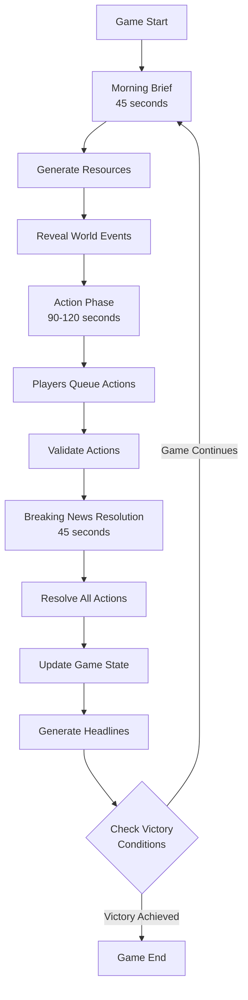

# **Technical Architecture Guide**

## **1. Tech Stack & Architectural Decisions**

The game follows a client-server architecture, built on Cloudflare's serverless platform for performance and scalability.

### **1.1. Technology Choices**

* **Frontend:**
    * **UI:** Neobrutalism Components based on shadcn/ui
    * **Map:** Maplibre GL JS for interactive world map
    * **Framework:** TypeScript with modern ES modules for optimal performance and type safety
    * **Build Tool:** Vite with TypeScript support
    * **PWA:** Service Worker for offline-first experience
* **Backend:**
    * **Game Logic & API:** Cloudflare Workers with ES modules
    * **Multiplayer State:** Partykit for real-time synchronization
    * **Persistence:** Cloudflare Durable Objects for game state and D1 for structured data
    * **Storage:** Cloudflare KV for session data and caching
    * **CDN:** Cloudflare's global network for asset delivery

### **1.2. Frontend Architecture**

* **PWA Support:** Progressive Web App with service worker for offline-first features and installability. Cloudflare Workers use ES modules for better execution context reuse across multiple requests.
* **Responsive Design:** Fully responsive UI adapting to both mobile and desktop screens. Touch-optimized controls are a priority.
* **State Management:** Global and game state managed in a simple, centralized store, with state synced from the backend via Partykit.

### **1.3. Backend Architecture**

* **Edge-First:** All backend logic runs on Cloudflare's edge network for low latency globally.
* **Fast Cold Start:** Cloudflare Workers provide near-instant cold starts for responsive gameplay.
* **Modularity:** Game logic, UI, map, and multiplayer are in isolated files/modules for maintainability.

### **1.4. Key Technical Features**

* **Replay & Logging System:** Every game action is a structured, loggable event that can be used to replay any game session.
* **AI Bot Support:** Architecture includes hooks for adding AI agents for playtesting, offline play, or filling empty player slots.
* **Versioning:** Game rules and faction data are versioned to ensure backward compatibility for replays.

### **1.5. TypeScript Strategy**

* **Strict Configuration:** All strict TypeScript flags enabled for maximum type safety
* **Shared Types:** Common type definitions across frontend and backend
* **API Contracts:** Type-safe interfaces for all API endpoints
* **Runtime Validation:** Zod schemas for runtime type checking
* **ES Modules:** All code uses ES modules for optimal performance and tree shaking

### **1.6. Development Tools**

* **Version Control:** Git with conventional commits
* **Testing:** Vitest for unit tests, Playwright for E2E testing
* **Linting:** ESLint with TypeScript support
* **Formatting:** Prettier for consistent code style
* **Type Checking:** Strict TypeScript configuration throughout
* **Build System:** ES modules optimized for Cloudflare Workers performance

## **2. System Architecture**

### **2.1. System Overview**



### **2.2. Game Engine Architecture**



### **2.3. Multiplayer Data Flow**



### **2.4. News Cycle Turn Flow**



## **3. Project Structure & Organization**

### **3.1. Recommended Project Structure**

```
Satire Empire/
├── game/                          # Main game code
│   ├── client/                    # Frontend TypeScript code
│   │   ├── components/           # Game UI components
│   │   │   ├── game/            # In-game components
│   │   │   ├── lobby/           # Lobby and matchmaking
│   │   │   ├── map/             # Map and territory components  
│   │   │   └── ui/              # Shared UI components
│   │   ├── stores/              # State management
│   │   │   ├── gameStore.ts     # Game state
│   │   │   ├── playerStore.ts   # Player data
│   │   │   └── uiStore.ts       # UI state
│   │   ├── services/            # External services
│   │   │   ├── api.ts           # API client
│   │   │   ├── websocket.ts     # Real-time communication
│   │   │   └── storage.ts       # Local storage
│   │   ├── utils/               # Client utilities
│   │   ├── types/               # Client-specific types
│   │   └── main.ts              # App entry point
│   ├── server/                   # Cloudflare Workers backend
│   │   ├── api/                 # API endpoints
│   │   │   ├── auth/            # Authentication
│   │   │   ├── game/            # Game management
│   │   │   ├── lobby/           # Matchmaking
│   │   │   └── player/          # Player management
│   │   ├── game-engine/         # Core game logic
│   │   │   ├── actions/         # Player actions (Invest, Influence, Invade)
│   │   │   ├── events/          # Game events and news cycle
│   │   │   ├── factions/        # Faction definitions and abilities
│   │   │   ├── map/             # Territory and map logic
│   │   │   ├── resources/       # Resource management
│   │   │   ├── victory/         # Victory condition checking
│   │   │   └── engine.ts        # Main game engine
│   │   ├── multiplayer/         # Real-time multiplayer
│   │   │   ├── partykit/        # Partykit integration
│   │   │   ├── state/           # Game state management
│   │   │   └── sync.ts          # State synchronization
│   │   ├── persistence/         # Data storage
│   │   │   ├── d1/              # D1 database operations
│   │   │   ├── kv/              # KV store operations
│   │   │   └── durableObjects/  # Durable Objects
│   │   ├── services/            # External services
│   │   ├── utils/               # Server utilities
│   │   └── worker.ts            # Workers entry point
│   ├── shared/                   # Shared code between client/server
│   │   ├── types/               # Shared TypeScript types
│   │   │   ├── game.ts          # Game state types
│   │   │   ├── player.ts        # Player types
│   │   │   ├── faction.ts       # Faction types
│   │   │   ├── map.ts           # Map and territory types
│   │   │   └── api.ts           # API contract types
│   │   ├── constants/           # Game constants
│   │   │   ├── gameConfig.ts    # Game configuration
│   │   │   ├── factions.ts      # Faction definitions
│   │   │   └── map.ts           # Map configuration
│   │   ├── utils/               # Shared utilities
│   │   │   ├── validation.ts    # Input validation
│   │   │   ├── calculations.ts  # Game calculations
│   │   │   └── helpers.ts       # Common helpers
│   │   └── schemas/             # Zod validation schemas
│   ├── assets/                   # Game assets
│   │   ├── images/              # Image assets
│   │   ├── sounds/              # Audio assets
│   │   ├── data/                # Game data files
│   │   └── localization/        # i18n files
│   └── tests/                    # Test files
│       ├── client/              # Client tests
│       ├── server/              # Server tests
│       ├── shared/              # Shared code tests
│       ├── e2e/                 # End-to-end tests
│       └── fixtures/            # Test data
├── docs/                         # Game documentation
├── ui/                          # UI component library
├── agents/                      # AI development agents
├── template/                    # Context engineering templates
├── examples/                    # Code examples and patterns
└── README.md
```

### **3.2. Key Architecture Decisions**

#### **Client-Server Split**
- **`game/client/`**: Frontend TypeScript code, runs in browser
- **`game/server/`**: Backend logic, runs on Cloudflare Workers  
- **`game/shared/`**: Code shared between client and server

#### **Game Engine Organization**
- **Modular design**: Each game system is a separate module
- **Action-based**: Player actions drive all game state changes
- **Event-driven**: Game events trigger state updates and notifications

#### **Real-time Multiplayer**
- **Partykit integration**: WebSocket connections for real-time updates
- **State synchronization**: Optimistic updates with server reconciliation
- **Conflict resolution**: Server authority for all game state

#### **TypeScript Organization**
- **Shared types**: Common interfaces between client and server
- **Validation schemas**: Zod schemas for runtime type checking
- **Barrel exports**: Clean import structure with index.ts files

### **3.3. Development Workflow**

1. **Start with shared types**: Define interfaces in `game/shared/types/`
2. **Implement game logic**: Core mechanics in `game/server/game-engine/`
3. **Add API endpoints**: REST API in `game/server/api/`
4. **Build UI components**: Components in `game/client/components/`
5. **Integrate real-time**: WebSocket communication via Partykit
6. **Add tests**: Unit tests and E2E tests for all systems
7. **Polish and optimize**: Performance, accessibility, and UX improvements

---

This comprehensive technical guide covers all architectural decisions, system design, and practical implementation details needed to build Satire Empire.